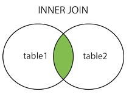
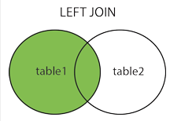
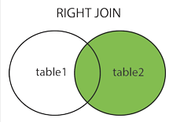

### SQL基本用法

[TOC]

#### 定义

SQL：结构化查询语言(Structured Query Language)   腾讯云使用的是mysql数据库

#### 语法规范

SQL语句语法不区分大小写

#### 主要内容

| CRUD        | 新增(create) | 查询 (retrieve) | 更新(update) | 删除(delete) |
| ----------- | ------------ | --------------- | ------------ | ------------ |
| 对应写法    | INSERT       | SELECT          | UPDATE       | DELETE       |
| API请求方式 | POST         | GET             | PUT          | DELETE       |

#### SELECT

~~~mysql
SELECT column_name,column_name FROM table_name [WHERE Clause][LIMIT N][ OFFSET M];

SELECT * FROM table_name [WHERE Clause];

/*e.g.*/
SELECT * FROM trolley_user WHERE trolley_user.id = ? AND trolley_user.user = ?
/* 限制数量 */
SELECT * FROM comment WHERE comment.product_id = ? LIMIT 1 OFFSET 0；
/* 运用函数 */
SELECT COUNT(id) AS comment_count FROM comment WHERE comment.product_id = ?；
~~~

#### INSERT

~~~mysql
INSERT INTO table_name ( field1, field2,...fieldN ) VALUES ( value1, value2,...valueN );

/*e.g.*/
INSERT INTO comment(user, username, avatar, content, images, product_id) VALUES (?, ?, ?, ?, ?, ?)

/* insert多条数据*/
INSERT INTO comment(user, username, avatar, content, images, product_id) VALUES (?, ?, ?, ?, ?, ?),(?, ?, ?, ?, ?, ?),(?, ?, ?, ?, ?, ?);
~~~

#### UPDATE

~~~mysql
UPDATE table_name SET field1=new-value1, field2=new-value2 [WHERE Clause];

/*e.g.*/
UPDATE trolley_user SET count = ? WHERE trolley_user.id = ? AND trolley_user.user = ?;
~~~

#### DELETE

~~~mysql
DELETE FROM table_name [WHERE Clause];
/*e.g.*/
DELETE FROM trolley_user WHERE trolley_user.user = ?;
~~~

> 一定要记得写上`where`条件，切勿**删库跑路**

#### INNER JOIN, LEFT JOIN, RIGHT JOIN

- **INNER JOIN（内连接,或等值连接）**：获取两个表中字段匹配关系的记录。
- 
- **LEFT JOIN（左连接）：**获取左表所有记录，即使右表没有对应匹配的记录。
- 
- **RIGHT JOIN（右连接）：** 与 LEFT JOIN 相反，用于获取右表所有记录，即使左表没有对应匹配的记录。
- 

>  参考地址：http://www.runoob.com/mysql/mysql-join.html

~~~mysql
SELECT order_user.id AS `id`, order_user.user AS `user`, order_user.create_time AS `create_time`, order_product.product_id AS `product_id`, order_product.count AS `count`, product.name AS `name`, product.image AS `image`, product.price AS `price` FROM order_user LEFT JOIN order_product ON order_user.id = order_product.order_id LEFT JOIN product ON order_product.product_id = product.id WHERE order_user.user = ? ORDER BY order_product.order_id
~~~

#### AS

取别名，常用在select语句中，保证输出的字段名

~~~mysql
SELECT COUNT(id) AS comment_count FROM comment WHERE comment.product_id = ?;
SELECT order_user.id AS `id`, order_user.user AS `user`, order_user.create_time AS `create_time`, order_product.product_id AS `product_id`, order_product.count AS `count`, product.name AS `name`, product.image AS `image`, product.price AS `price` FROM order_user LEFT JOIN order_product ON order_user.id = order_product.order_id LEFT JOIN product ON order_product.product_id = product.id WHERE order_user.user = ? ORDER BY order_product.order_id
~~~

#### SQL在node.js中的用法

`?`为占位符

可以在mysql管理工具中先进行测试sql语句

~~~javascript
	/**
 	 * 更新购物车商品列表
 	 */
  update: async ctx => {
    let user = ctx.state.$wxInfo.userinfo.openId
    let productList = ctx.request.body.list || []

    // 购物车旧数据全部删除
    await DB.query('DELETE FROM trolley_user WHERE trolley_user.user = ?', [user])

    let sql = 'INSERT INTO trolley_user(id, count, user) VALUES '
    let query = []
    let param = []

    productList.forEach(product => {
      query.push('(?, ?, ?)')

      param.push(product.id)
      param.push(product.count || 1)
      param.push(user)
    })

    await DB.query(sql + query.join(', '), param)

    ctx.state.data = {}
  },
~~~

